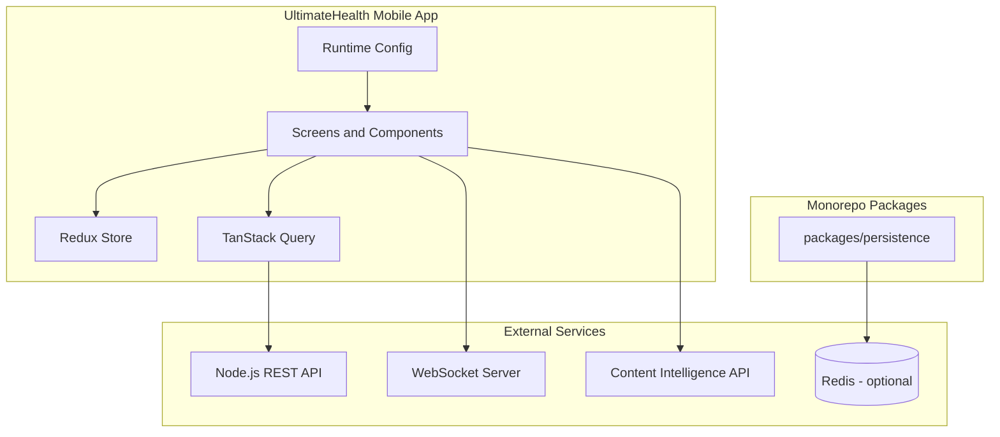
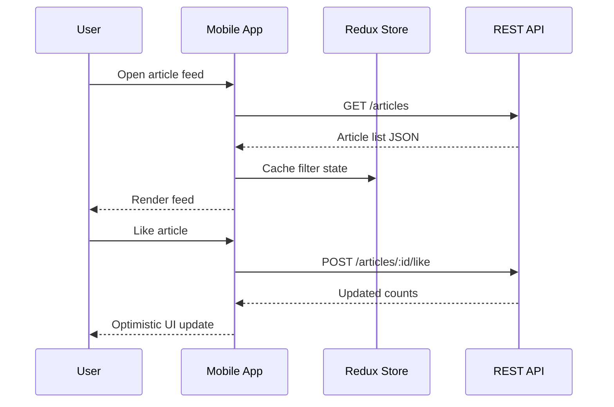

# UltimateHealth

Open-source mobile platform for trusted health articles, podcasts, AI-assisted wellness chat, and community-driven content review. This repository contains the **Expo React Native application** and supporting TypeScript packages.

## Feature Highlights

- **Multilingual articles** — Read and publish health content with translation workflows
- **Podcast library** — Stream, record, and manage health podcasts with offline support
- **AI wellness chat** — Character-based health Q&A powered by configurable AI backends
- **Guest mode** — Browse articles and podcasts without signing in
- **Community review** — Collaborative editing, trust signals, and moderation tooling
- **Wellness dashboard** — Activity tracking and wearable sync entry points
- **Push notifications** — Firebase Cloud Messaging integration
- **Optional cache layer** — Redis-backed persistence package for development tooling

## Architecture



## Request Workflow



## Project Structure

```
UltimateHealth/
├── frontend/              # Expo React Native app (TypeScript)
│   ├── src/
│   │   ├── components/    # Shared UI
│   │   ├── screens/       # Route views
│   │   ├── hooks/         # API hooks
│   │   ├── services/      # Monitoring, storage helpers
│   │   ├── config/        # Environment accessors
│   │   └── store/         # Redux slices
│   └── app.config.js      # Expo dynamic config
├── packages/
│   └── persistence/       # Optional Redis layer
├── docs/
│   └── internal/          # Maintainer audit and structure notes
└── .github/workflows/     # CI and EAS build pipelines
```

See [docs/internal/STRUCTURE.md](docs/internal/STRUCTURE.md) for structural decisions.

## Prerequisites

| Tool | Version | Notes |
|------|---------|-------|
| Node.js | ≥ 20 | LTS recommended |
| npm or Yarn | Latest | npm workspaces supported at repo root |
| Expo CLI | Via `npx expo` | Bundled with project |
| Android Studio | Latest | Android emulator |
| Xcode | Latest | macOS only, iOS builds |

## Installation

```bash
git clone https://github.com/SB2318/UltimateHealth.git
cd UltimateHealth

# Install all workspaces (frontend + packages)
npm install

# Copy environment templates
cp frontend/.env.example frontend/.env
cp packages/persistence/.env.example packages/persistence/.env
```

### Mobile app only

```bash
cd frontend
npm install --legacy-peer-deps
npm run check-env
npm run start
```

## Configuration

### Mobile environment (`frontend/.env`)

| Variable | Purpose |
|----------|---------|
| `PROD_URL` | REST API base URL |
| `SOCKET_PROD` | WebSocket server URL |
| `CONTENT_CHECKER_PROD` | Content intelligence service URL |
| `EXPO_PUBLIC_GEMINI_API_KEY` | Gemini API key for AI summaries |
| `EXPO_PUBLIC_SENTRY_DSN` | Sentry error reporting DSN |
| `FIREBASE_*` | Firebase project credentials |

Values are injected through `app.config.js` into `expo-constants` at build time.

### Redis persistence (`packages/persistence/.env`)

| Variable | Default | Purpose |
|----------|---------|---------|
| `REDIS_ENABLED` | `true` | Toggle cache layer |
| `REDIS_URL` | — | Full connection URL (optional) |
| `REDIS_HOST` | `127.0.0.1` | Redis host |
| `REDIS_PORT` | `6379` | Redis port |
| `REDIS_KEY_PREFIX` | `ultimatehealth:` | Key namespace |
| `REDIS_MAX_RETRIES` | `10` | Retry limit |
| `UH_LOG_LEVEL` | `info` | Persistence log level |

## Development

```bash
# From repository root — full validation suite
npm run validate

# Frontend only
cd frontend
npm run type-check
npm run lint
npm run test
npm run start          # Expo dev server
npm run android        # Native Android build
npm run ios            # Native iOS build (macOS)
```

### Branch naming

| Prefix | Use |
|--------|-----|
| `feat/` | New features |
| `fix/` | Bug fixes |
| `docs/` | Documentation |
| `refactor/` | Internal refactors |
| `test/` | Test coverage |
| `chore/` | Tooling and CI |

Use [Conventional Commits](https://www.conventionalcommits.org/) for commit messages.

## Testing

```bash
# Unit tests (Jest + React Native Testing Library)
cd frontend && npm test

# Persistence package (Vitest)
cd packages/persistence && npm test

# Dead code analysis
cd frontend && npm run knip
```

Test files live alongside source under `__tests__/` directories. See [TEST_GUIDELINES.md](TEST_GUIDELINES.md) for project conventions.

## Troubleshooting

### Metro port conflict

```bash
npx kill-port 8081
npx expo start --port 8082
```

### npm peer dependency errors

```bash
cd frontend
npm install --legacy-peer-deps
```

### Android SDK not found

Set `ANDROID_HOME` to your SDK path and add platform-tools to `PATH`.

### Expo Go SDK mismatch

Update Expo Go on your device or use a development build:

```bash
npx expo start --dev-client
```

### Type-check failures after dependency updates

```bash
rm -rf node_modules
npm install --legacy-peer-deps
npm run type-check
```

### Redis connection refused

Ensure Redis is running locally (`redis-server`) or set `REDIS_ENABLED=false` to skip the persistence layer.

## FAQ

**Where is the backend API?**  
The Node.js REST API and MongoDB backend live in a separate repository ([ultimatehealth-backend](https://github.com/SB2318/ultimatehealth-backend)). Configure `PROD_URL` to point at production or your local instance.

**Is Redis required for the mobile app?**  
No. The persistence package is optional and targets development tooling, CI fixtures, and future cache integrations — not the React Native runtime.

**Can I use npm instead of Yarn?**  
Yes. The root workspace uses npm. The frontend CI still references Yarn lockfiles; both package managers work locally with `--legacy-peer-deps` for npm.

**How do I run on a physical device?**  
Use Expo dev client or EAS builds. Push notifications require a physical device with FCM configured.

## Contributing

1. Browse [open issues](https://github.com/SB2318/UltimateHealth/issues)
2. Fork the repository and create a feature branch
3. Run `npm run validate` before opening a PR
4. Read [CONTRIBUTING.md](CONTRIBUTING.md) and [CODE_OF_CONDUCT.md](CODE_OF_CONDUCT.md)

Maintainer documentation:

- [docs/internal/AUDIT.md](docs/internal/AUDIT.md) — Architecture audit and improvement log
- [docs/internal/STRUCTURE.md](docs/internal/STRUCTURE.md) — Folder layout decisions

## License

See [LICENSE](LICENSE) for details.

## Related Services

| Service | Repository |
|---------|------------|
| Backend API | [ultimatehealth-backend](https://github.com/SB2318/ultimatehealth-backend) |
| Admin panel | [ultimatehealth-admin-app](https://github.com/SB2318/ultimatehealth-admin-app) |
| Content checker | [VeriWise-Content-Check](https://github.com/SB2318/VeriWise-Content-Check) |
